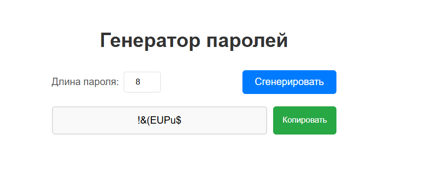

Генератор паролей
Создано интерактивное React-приложение "Генератор паролей" с минималистичным современным интерфейсом. Приложение позволяет пользователям генерировать безопасные случайные пароли через интуитивно понятные элементы управления.

Основные возможности
Функциональность
Генерация случайных паролей - кнопка "Сгенерировать"
Настройка длины пароля - интуитивный числовой ввод
Копирование в буфер обмена - удобная кнопка копирования
Адаптивный дизайн - корректное отображение на мобильных устройствах

Дизайн-особенности
Чистая светлая цветовая палитра с тенями
Минималистичный интерфейс без лишних элементов
Плавные переходы при взаимодействии
Семантические цвета для различных действий

Особенности реализации
React 18 - основная библиотека с хуками
JavaScript (ES6+) - современный синтаксис
CSS-модули - компонентная стилизация
Адаптивная верстка - поддержка разных экранов

Технологический стек
 React
 CSS3
 JavaScript ES6+
 npm

Рабочее окно приложения:
